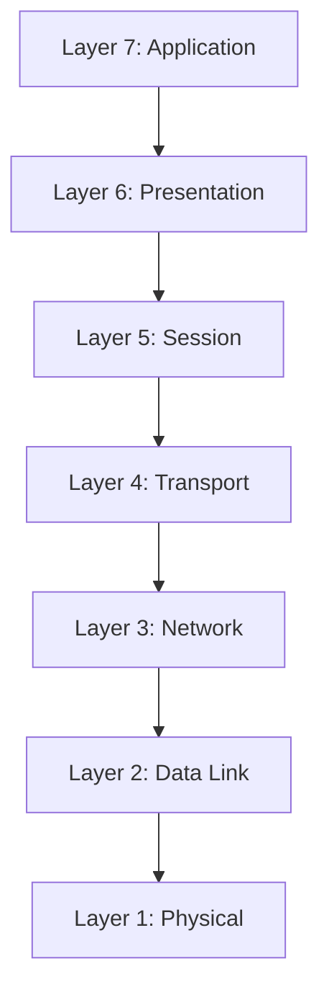

# OSI Model (CCNA)

The OSI model defines 7 layers used to standardize network communication.

## OSI Layer Diagram

## Layer Responsibilities

| Layer | Name | Function |
|------|------|---------|
| 7 | Application | Network services to user applications |
| 6 | Presentation | Data translation, encryption |
| 5 | Session | Session management |
| 4 | Transport | End-to-end communication (TCP/UDP) |
| 3 | Network | Routing and logical addressing (IP) |
| 2 | Data Link | MAC addressing, switching |
| 1 | Physical | Transmission of raw bits |

## Packet Encapsulation Flow

This diagram represents how data moves down the OSI layers during encapsulation.
